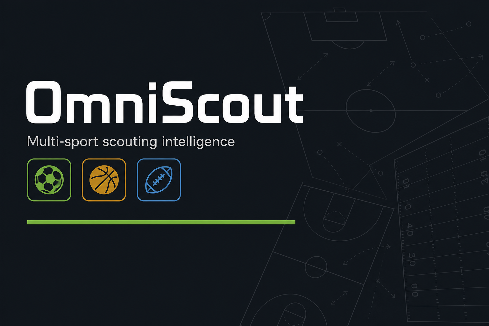
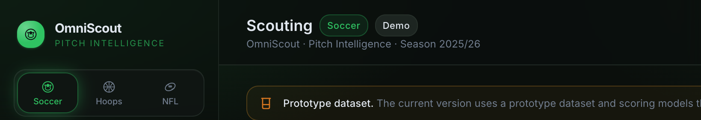

# OmniScout

<p align="center">
  
</p>

**Sports Intelligence** multi-desporto (futebol, basquete, futebol americano) para scouting e recruitment — com **honestidade de dados** como feature, não volume inventado.

[Live demo](https://football-intelligence-plataform.vercel.app/) · [MVP / pitch](./docs/OMNISCOUT-MVP.md) · [Product UI north star](./docs/PRODUCT-UI-NORTH-STAR.md) · [Data runbook](./docs/STARTUP-DATA-RUNBOOK.md)

---

## O que é

OmniScout é uma mesa de scout freemium: descobrir → shortlist → recruitment fit → compare → report, no mesmo shell para **Soccer / Basketball / American Football**.

Diferencial:

1. **Profundidade honesta** — piso produtivo real (≥4 aparições **e** ≥270′ no soccer); sem stubs de vaidade.
2. **Mercados negligenciados** — Big5 agora, Brasileirão a seguir, Colleges/HS na tese.

<p align="center">
  
</p>

<p align="center"><em>Scouting desk (demo) — soccer / basketball / AF no mesmo workflow.</em></p>

---

## Estado do projeto (agosto 2026)

| Área | Status |
|------|--------|
| App (Next.js) em Production | Live — [vercel](https://football-intelligence-plataform.vercel.app/) |
| Intelligence (roles, fit, trajectory, briefs) | MVP usable |
| Startup KPI Big5 (≥1 temporada produtiva) | **Freeze ~85%** (aspiracional ≥90% em background) |
| Brasileirão (pilar #2) | **Freeze ~81%** |
| Product UI nível Opta Analyst | **Em curso** — sair do look AI |
| Colleges / High School | Tese — ainda não |
| Auth / piloto pago | Ainda não |

> **Nota de demo:** o deploy público pode correr em `DATA_SOURCE=mock` (dataset de protótipo). A profundidade real (Big5/BR) vive na base Supabase com `DATA_SOURCE=db` e nos pipelines `npm run data:*`.

---

## Stack

- **Next.js** (App Router) + TypeScript + Tailwind  
- **Supabase Postgres** + Prisma (RLS lockdown)  
- Pipelines: ESPN boxscores + API-Football (quota free ~100/dia)  
- Deploy: Vercel (`main` → Production)

---

## Quick start

```bash
cp .env.example .env   # DATABASE_URL, APISPORTS_KEY, DATA_SOURCE=db|mock
npm install
npx prisma generate
npm run dev
```

Demos: [docs/DEMO-DATA-SOURCE.md](./docs/DEMO-DATA-SOURCE.md).

### Dados (db)

```bash
npm run data:coverage          # Startup KPI Big5 + depth
npm run data:backfill-soccer-seasons -- --low-quota   # ~12 calls API
npm run data:backfill-boxscores -- --days=30 --slug=bra.1 --seasonYear=2025 --no-create
```

Runbook completo: [docs/STARTUP-DATA-RUNBOOK.md](./docs/STARTUP-DATA-RUNBOOK.md).

---

## Scoring (resumo soccer)

| Conceito | Regra |
|----------|--------|
| Goals/90 | `(goals / minutes) × 90`, soft-cap **1.8** |
| Rating | Proxy g/90 & a/90 com minutos ≥ 450 |
| Temporada produtiva | ≥4 aparições **e** ≥270′ (`data-depth.ts`) |

Detalhe: [docs/SCORING.md](./docs/SCORING.md) · `/methodology` na app.

---

## Roadmap curto

1. Big5 → **≥90%** (API low-quota no reset)  
2. Brasileirão → **≥90%** (ESPN)  
3. Freeze soccer showcase  
4. **Product UI** (inspiração [Opta Analyst](https://www.statsperform.com/about/opta-analyst/) / [theanalyst.com](https://theanalyst.com/))  
5. Ligas de transição · Colleges/HS · piloto  

Contexto para o Cursor: [`PROMPT_CONTEXT.md`](./PROMPT_CONTEXT.md).

---

## Docs

| Doc | Uso |
|-----|-----|
| [OMNISCOUT-MVP.md](./docs/OMNISCOUT-MVP.md) | Narrativa startup |
| [PRODUCT-UI-NORTH-STAR.md](./docs/PRODUCT-UI-NORTH-STAR.md) | Design futuro |
| [STARTUP-DATA-RUNBOOK.md](./docs/STARTUP-DATA-RUNBOOK.md) | Comandos de profundidade |
| [DATA-COVERAGE.md](./docs/DATA-COVERAGE.md) | Inventário de cobertura |
| [INTELLIGENCE-PARITY-V1-AUDIT.md](./docs/INTELLIGENCE-PARITY-V1-AUDIT.md) | Paridade de intelligence |

---

## Licença / nota

Projeto em evolução — scoring e cobertura ainda a refinar. Não é um feed Opta enterprise; é a camada de decisão de scout em cima de dados públicos + pipelines próprios.
