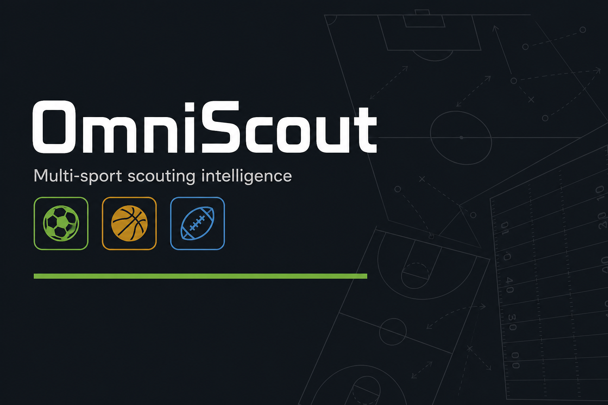
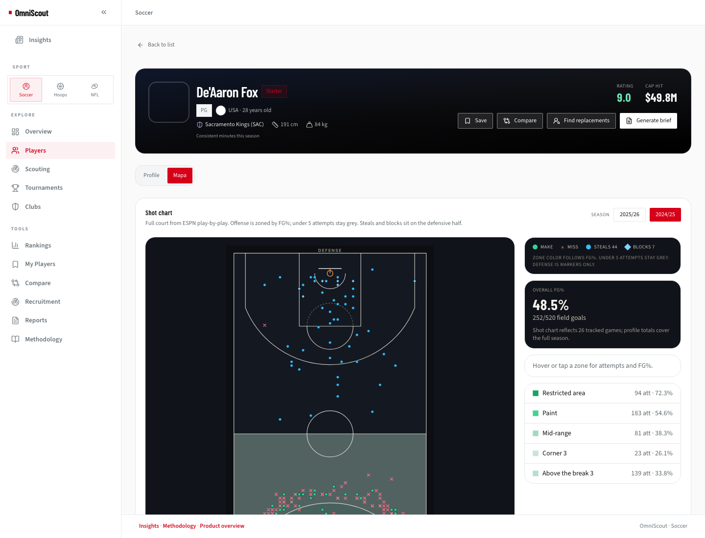
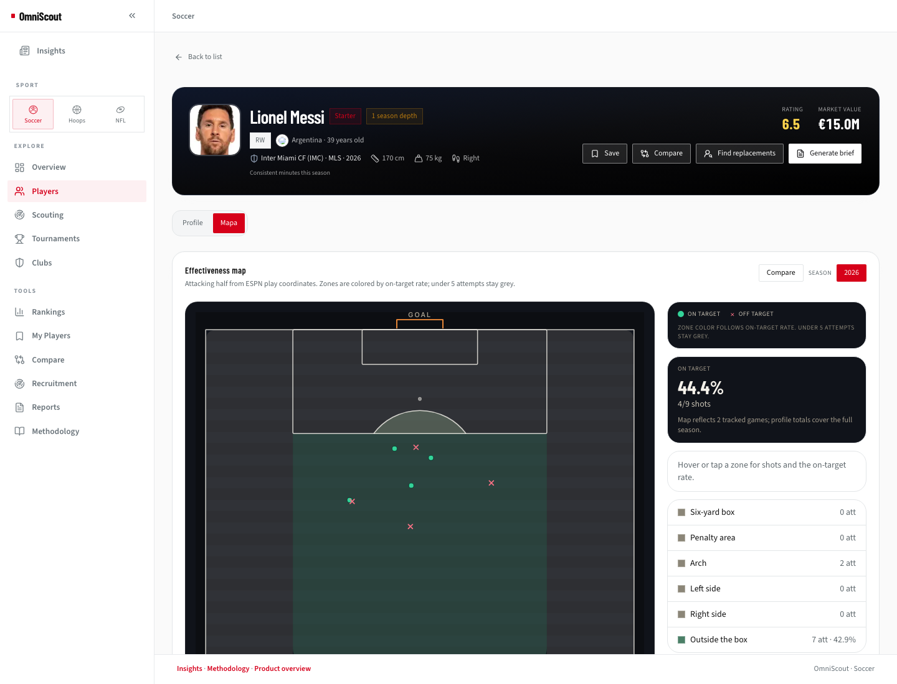
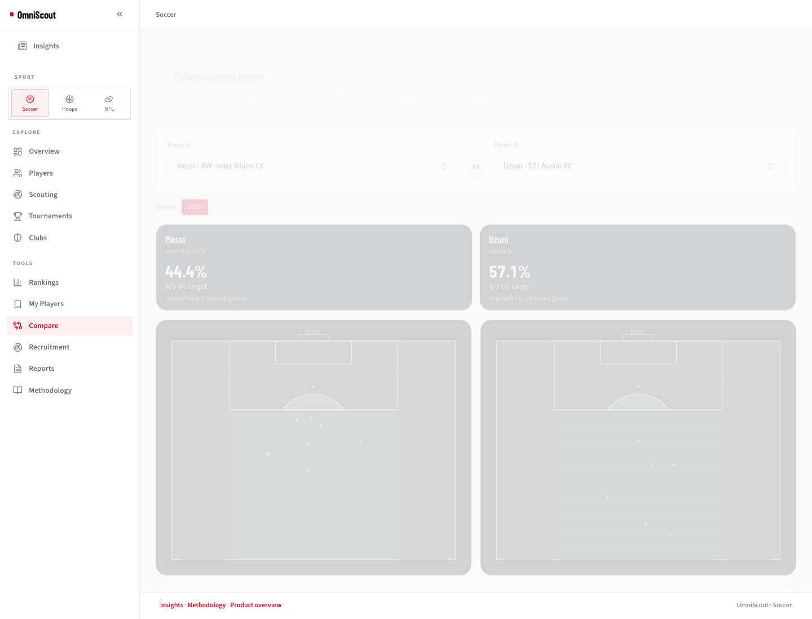

# OmniScout

<p align="center">
  
</p>

OmniScout is a multi-sport scouting desk for soccer, basketball, and American football. It turns public game data into roles, fit, comparisons, and briefs, and it refuses invented stats: a soccer season counts only with at least four appearances and 270 minutes, shot maps stay grey under five attempts, and estimated xG is labeled as an estimate.

**Live:** [omni-scout.vercel.app](https://omni-scout.vercel.app)

---

## Status — October 2026

| Area | Now |
|------|-----|
| Production | [omni-scout.vercel.app](https://omni-scout.vercel.app) on Vercel (`main`) |
| Basketball shot charts | Multi-season court maps (field goals, steals, blocks). Rates stay hidden under five attempts |
| Soccer effectiveness maps | Player map, team map, and a [side-by-side comparator](https://omni-scout.vercel.app/compare/maps) for one shared season |
| Newsletter | [The In Between Game](https://omni-scout.vercel.app/insights) — one question, the data, one chart. Archive in the app; email on Substack |
| Intelligence | Roles, recruitment fit, trajectory, and scout briefs |
| Auth / paid pilot | Not yet |

<p align="center">
  
</p>

<p align="center"><em>Basketball shot chart — De'Aaron Fox, 2024/25. 252/520 field goals across 26 tracked games.</em></p>

<p align="center">
  
</p>

<p align="center"><em>Soccer effectiveness map — Lionel Messi, MLS 2026. 4/9 on target; zones under five attempts stay grey.</em></p>

<p align="center">
  
</p>

<p align="center"><em>Map comparator — Messi and Uzuni, 2026, same zones and the same grey-under-five rule.</em></p>

---

## Stack

- Next.js (App Router), TypeScript, Tailwind
- Supabase Postgres and Prisma, with row-level security locked down
- Ingestion through a provider interface. ESPN is the live adapter; API-Football enriches soccer within a free daily quota; CollegeFootballData is optional for CFB
- Deploy: Vercel, `main` to production

---

## Quick start

```bash
cp .env.example .env   # DATABASE_URL, APISPORTS_KEY, DATA_SOURCE=db|mock
npm install
npx prisma generate
npm run dev
```

Demo data modes: [docs/DEMO-DATA-SOURCE.md](./docs/DEMO-DATA-SOURCE.md).

```bash
npm run data:coverage
npm run data:backfill-soccer-seasons -- --low-quota
```

Depth commands: [docs/STARTUP-DATA-RUNBOOK.md](./docs/STARTUP-DATA-RUNBOOK.md). Provider swap (one adapter plus env vars): [docs/data-providers.md](./docs/data-providers.md).

---

## Soccer scoring, in short

| Idea | Rule |
|------|------|
| Goals/90 | `(goals / minutes) × 90`, soft cap 1.8 |
| Rating | Goals/90 and assists/90 proxy, minutes at least 450 |
| Productive season | At least 4 appearances **and** 270 minutes |

Detail: [docs/SCORING.md](./docs/SCORING.md) and `/methodology` in the app.

---

## Docs

| Doc | Use |
|-----|-----|
| [OMNISCOUT-MVP.md](./docs/OMNISCOUT-MVP.md) | Startup narrative |
| [PRODUCT-UI-NORTH-STAR.md](./docs/PRODUCT-UI-NORTH-STAR.md) | Design direction |
| [STARTUP-DATA-RUNBOOK.md](./docs/STARTUP-DATA-RUNBOOK.md) | Depth pipelines |
| [DATA-COVERAGE.md](./docs/DATA-COVERAGE.md) | Coverage inventory |
| [data-providers.md](./docs/data-providers.md) | ESPN now; paid adapters later |
| [INTELLIGENCE-PARITY-V1-AUDIT.md](./docs/INTELLIGENCE-PARITY-V1-AUDIT.md) | Intelligence parity |

This is a scout decision layer on public feeds and our own pipelines, not an Opta enterprise feed.
